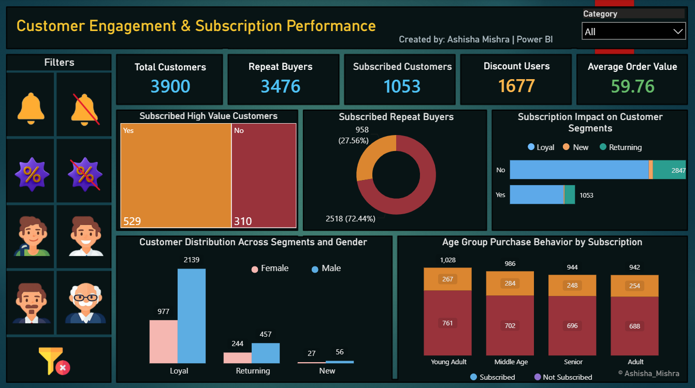
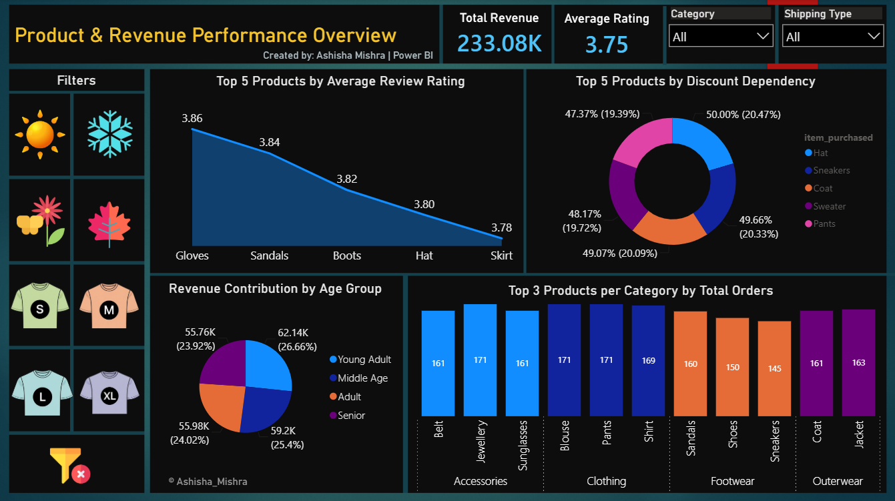
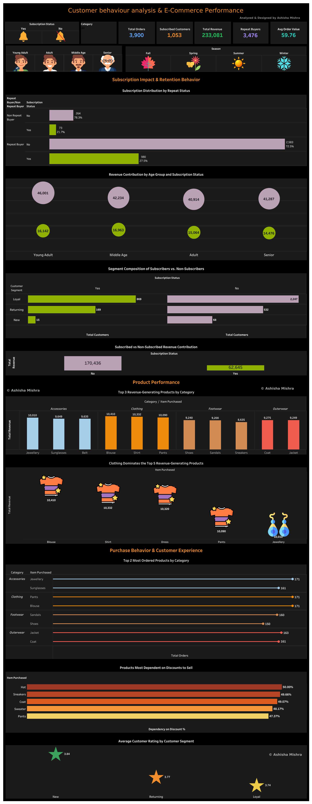

# 🛍️ Customer Behaviour Analysis: Retail Company

An end-to-end analysis of retail customer shopping behaviour using SQL, Python, Power BI, and Tableau, uncovering subscription trends, purchase patterns, and revenue drivers.

## 🛠️ Tools Used

SQL: Data cleaning, transformation, and querying

Python: Exploratory data analysis and preprocessing (Jupyter Notebook)

Power BI: Data modeling, visualization, and interactive dashboard design

Tableau: Supplementary dashboard for e-commerce performance and customer behaviour analysis

## 🗃️ SQL Queries

See the full list of SQL queries used in this project: [SQL_File](CBA.sql)

## 🐍 Python Analysis

Exploratory analysis and data preparation notebook: [Pyhton_File](E2E_PROJECT_2_Customer_Behaviour_Analysis.ipynb)

## 📊 Dashboard Overview

### 📌 Power BI | Page 1: Customer Engagement & Subscription Performance

**3,900** total customers with **3,476** repeat buyers and **1,053** subscribed customers
**1,677** discount users and an average order value of **59.76**
Subscription impact on customer segments (Loyal, New, Returning) and repeat-buyer behaviour
Customer distribution across segments and gender
Age group purchase behaviour by subscription status (Young Adult, Middle Age, Senior, Adult)

### 📌 Power BI | Page 2: Product & Revenue Performance Overview

**233.08K** total revenue with an average product rating of **3.75**
Top 5 products by average review rating and by discount dependency
Revenue contribution by age group
Top 3 products per category by total orders across Accessories, Clothing, Footwear, and Outerwear
Filters for Category and Shipping Type

## 🔗 Power BI Dashboard
[View Live Dashboard](https://app.powerbi.com/view?r=eyJrIjoiNzdiNzlhMjgtN2Y4NS00ZWRiLTg5ZjEtZjNiMTk2ZmE5ZDA1IiwidCI6ImYxNWQ4YWQ1LTViZjYtNDg1NC1iNGRkLTg1MDM1MGNiYjhlMCJ9)

### 📌 Tableau | Customer Behaviour Analysis & E-Commerce Performance

End-to-end view of subscription impact and retention behaviour
Subscription distribution by repeat status across Loyal and Non-Repeat buyers
Revenue contribution by age group and subscription status
Seasonal and category-based filtering across all views

## 📈 Tableau Dashboard — Customer Behaviour Analysis & E-Commerce Performance
[View Live Dashboard](https://public.tableau.com/views/E2EPROJECT2-RETAIL_COMPANY/Project?:language=en-US&:sid=&:redirect=auth&:display_count=n&:origin=viz_share_link)

### 🔑 Key Insights
Repeat buyers make up the majority of subscribed customers, showing subscriptions strongly support retention
Loyal customers vastly outnumber Returning and New segments across both genders
Young Adults lead in purchase volume, followed closely by Middle Age and Senior groups
Revenue is fairly evenly distributed across age groups, with Young Adults contributing the largest share (26.66%)
Hats and sneakers show the highest discount dependency among top products
Gloves and sandals receive the highest average review ratings

## 📄 License
This project is licensed under the MIT License.

## 👤 Author
Ashisha Mishra

LinkedIn:
